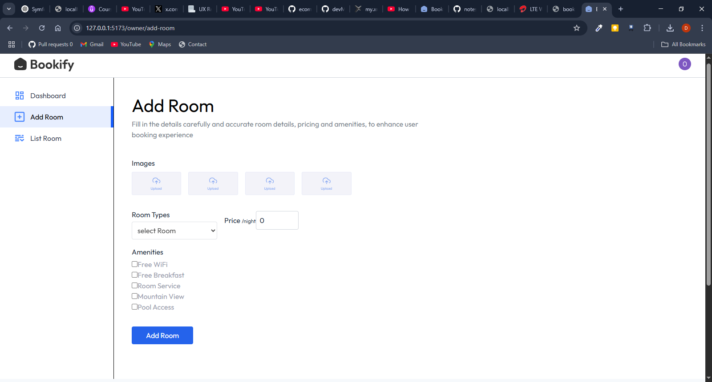
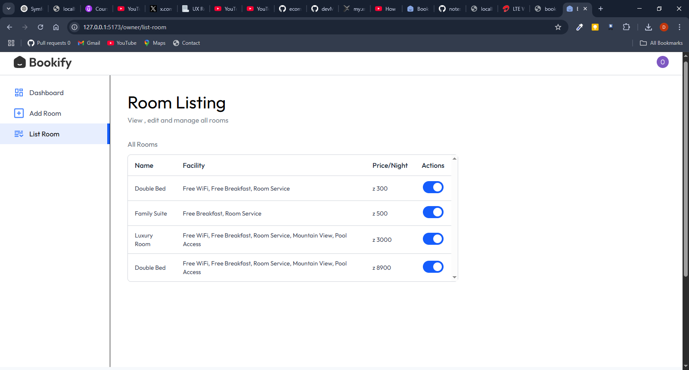
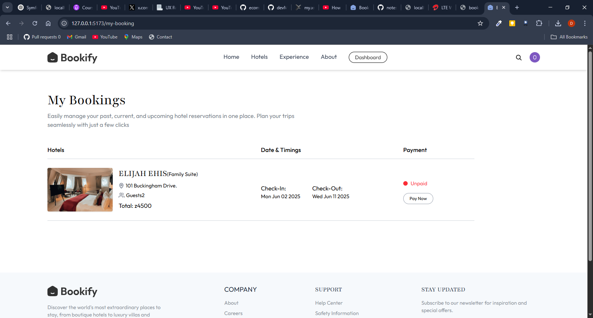

# Bookify – Hotel Reservation Web App 🏨

Bookify is a full-stack hotel reservation platform built with the **MERN stack** and enhanced with tools like **Clerk** for authentication, **Stripe** for payment, and **Cloudinary** for image uploads. It allows hotel owners to register hotels and manage bookings, while users can search, book, and pay for rooms seamlessly.

---


## 📁 Project Structure


```
📦 Bookify
├── client       # Frontend - React + Vite + Tailwind CSS
└── server       # Backend - Node.js + Express + MongoDB
```

---

## 🔧 Technologies Used

- **Frontend:** React, Vite, Tailwind CSS, Clerk, Stripe
- **Backend:** Node.js, Express, MongoDB, Multer, Cloudinary
- **Other Tools:** Svix (Webhooks), Email (SMTP), Axios, JWT

---

## 🚀 Getting Started Locally

## 📦 Prerequisites

Ensure the following are installed **before** running this project:

| Tool | Check | Install Command |
|------|-------|------------------|
| Node.js (v18 or higher) | ✅ `node -v` | [Download here](https://nodejs.org/en) |
| npm | ✅ `npm -v` | Comes with Node.js |
| Git | ✅ `git --version` | [Install Git](https://git-scm.com/downloads) |

> If you're on macOS/Linux, you can install Node via:
```bash
brew install node     # macOS with Homebrew
sudo apt install nodejs npm    # Ubuntu/Debian


### 🔹 Clone the Repo

```bash
git clone https://github.com/Elijahehis/Bookify
cd Bookify
```

### 🔹 Setup the Backend

```bash
cd server
npm install
```

Create a `.env` file in the `/server` directory with the following (replace with your real values):

```env
MONGODB_URL=your_mongodb_connection_url

CLERK_PUBLISHABLE_KEY=your_clerk_publishable_key
CLERK_SECRET_KEY=your_clerk_secret_key
CLERK_WEBHOOK=your_clerk_webhook_secret

CLOUDINARY_CLOUD_NAME=your_cloudinary_cloud_name
CLOUDINARY_API_KEY=your_cloudinary_api_key
CLOUDINARY_SECRET_KEY=your_cloudinary_secret_key

CURRENCY=z

SENDER_EMAIL=your_sender_email
SMTP_USER=your_smtp_user
SMTP_PASS=your_smtp_password
```

Then run the backend server:

```bash
npm run server
```

### 🔹 Setup the Frontend

```bash
cd ../client
npm install
```

Create a `.env` file in the `/client` directory with:

```env
VITE_CLERK_PUBLISHABLE_KEY=your_clerk_publishable_key
VITE_BACKEND_URL=http://localhost:3000/
VITE_CURRENCY=z
```

Then start the frontend app:

```bash
npm run dev
```

---

## 🌐 Deployment URLs

- **Frontend (Vercel):** [https://bookify-hazel.vercel.app](https://bookify-hazel.vercel.app)
- **Backend (Vercel):** [https://bookify-backend-nine.vercel.app](https://bookify-backend-nine.vercel.app)

---

## 📚 Features

### 👥 Users

- Register/Login via **Clerk**
- View featured hotels
- Check availability & book rooms
- View their bookings
- Pay via **Stripe**

### 🏨 Hotel Owners

- Register/Login via **Clerk**
- Register their hotel
- Access dashboard: view bookings, revenue, status
- Upload room images and details
- Toggle room availability

---

## 🔗 Key API Endpoints

### 📌 User Routes

- `GET /api/user/` – Get user data
- `POST /api/user/store-recent-search` – Store recent city searches

### 📌 Hotel Routes

- `POST /api/hotel/` – Register a new hotel

### 📌 Room Routes

- `POST /api/room/` – Create a new room (with image upload)
- `GET /api/room/` – Get all rooms
- `GET /api/room/owner` – Get rooms by hotel owner
- `POST /api/room/toggle-availability` – Toggle room availability

### 📌 Booking Routes

- `POST /api/booking/check-availability` – Check room availability
- `POST /api/booking/book` – Create a booking
- `GET /api/booking/user` – Get bookings for user
- `GET /api/booking/hotel` – Get bookings for hotel owner dashboard

---

## 📸 Screenshots

> ### 🏠 Homepage


### 📊 Hotel Owner Dashboard


### 🏨 Add Room


### 🛏️ List Rooms


### 🌍 Featured Destination


### 📚 My Bookings



---

## 👩‍💻 Author

Made by [Elijah Ehis](https://github.com/Elijahehis) —

---

## 📄 License

This project is licensed under the MIT License.
